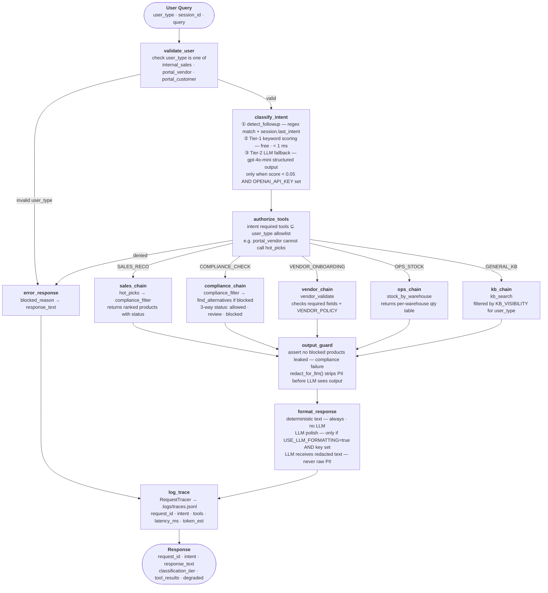

# AI Chat Service PoC

A production-oriented agentic chat service over mock ERP data.
Tool-first execution, deterministic compliance, two-tier intent classification, per-request observability.

## Quick Start

```bash
# Install dependencies
uv sync

# Copy env file and add OpenAI key (optional - system works without it)
cp .env.example .env

# Run the Streamlit demo UI (recommended)
uv run streamlit run app.py

# Run the CLI chat service
uv run main.py

# Run all tests
uv run pytest
```

No database setup. No Docker. Data loads from `data/seed_data (3).json` at startup.

## Architecture



Exactly 5 intent routes. No FOLLOW_UP intent — follow-up queries are detected by `detect_followup()` before classification and reuse `last_intent` + `last_product_ids` from session.

### When does OpenAI LLM get called?

The system runs fully without any LLM. There are exactly two optional LLM call sites:

| Call site | File | Condition |
|---|---|---|
| **Tier-2 intent classification** | `src/router.py` `_llm_classify()` | Keyword score < 0.05 (ambiguous query) **AND** `OPENAI_API_KEY` is set |
| **Response natural-language polish** | `src/graph.py` `_format_with_llm()` | `USE_LLM_FORMATTING=true` **AND** `OPENAI_API_KEY` is set |

Without `OPENAI_API_KEY`, all classification uses keyword scoring and all responses use deterministic formatting. The LLM receives only PII-redacted text.

## Module Map

| Module | Responsibility |
|---|---|
| `src/models.py` | Pydantic schemas for all data types and tool I/O. VENDOR_POLICY, TOOL_ALLOWLIST, INTENT_TOOLS config |
| `src/data.py` | Load seed_data.json into in-memory typed objects. `resolve_product()`, `find_alternatives()` helpers |
| `src/tools.py` | 5 deterministic tools: `hot_picks`, `compliance_filter`, `stock_by_warehouse`, `vendor_validate`, `kb_search` |
| `src/router.py` | 3 functions: `detect_followup()`, `extract_params()`, `classify_intent()` |
| `src/guardrails.py` | `validate_user`, `authorize_tools`, `output_guard` LangGraph nodes |
| `src/chains.py` | 5 chain nodes (one per intent). Tool calls + deterministic formatting |
| `src/state.py` | In-memory session dict: `last_intent`, `last_state`, `last_budget`, `last_product_ids` |
| `src/settings.py` | Centralized config via `configs.<key>` using `pydantic-settings` |
| `src/logging_config.py` | Loguru bootstrap for console + file logging |
| `src/observability.py` | `RequestTracer` context manager. Structured JSON logs per request |
| `src/graph.py` | LangGraph `StateGraph` definition. `run_query()` entry point |
| `src/_registry.py` | Tracer registry (avoids non-serializable objects in LangGraph state) |
| `main.py` | CLI chat loop |

## Intents and Canonical Chains

| Intent | Trigger | Chain |
|---|---|---|
| SALES_RECO | hot picks, recommend, best sellers | `hot_picks` -> `compliance_filter` |
| COMPLIANCE_CHECK | blocked, not available, alternatives | `compliance_filter` (+`find_alternatives` if blocked) |
| VENDOR_ONBOARDING | vendor, upload, lab report, missing fields | `vendor_validate` |
| OPS_STOCK | stock, warehouse, inventory, quantity | `stock_by_warehouse` |
| GENERAL_KB | return, shipping, SOP, policy | `kb_search` |

## User Types and Allowlists

| user_type | Accessible tools |
|---|---|
| internal_sales | all 5 tools |
| portal_vendor | vendor_validate, kb_search |
| portal_customer | hot_picks, compliance_filter, stock_by_warehouse, kb_search |

## Compliance Logic

`compliance_filter` produces exactly 3 statuses (deterministic, no LLM):
- **blocked** - state is in `product.blocked_states`
- **review** - product is not blocked but `lab_report_required = true`
- **allowed** - neither

## Observability

Every request logs a structured JSON record to `.logs/traces.jsonl`:
```json
{
  "request_id": "uuid",
  "timestamp": "ISO-8601",
  "session_id": "uuid",
  "user_type": "internal_sales",
  "intent": "SALES_RECO",
  "classification_tier": "keyword",
  "tools_called": [
    {"name": "hot_picks", "args": {"state": "CA", "budget": 5000}, "latency_ms": 0.5},
    {"name": "compliance_filter", "args": {"state": "CA", "product_ids": [...]}, "latency_ms": 0.3}
  ],
  "total_latency_ms": 12.0,
  "prompt_tokens_est": 45,
  "completion_tokens_est": 180
}
```

Token estimate: `len(text) // 4` (no tiktoken dependency).

Application logs also go to `.logs/application.log` with Loguru and include timestamp, level, module, function, and line number.

## Configuration

All runtime settings are centralized in `src/settings.py` and exposed through `configs.<key>`.

| Variable | Default | Description |
|---|---|---|
| `OPENAI_API_KEY` | (none) | Enables LLM Tier-2 classification and optional LLM response formatting |
| `USE_LLM_FORMATTING` | `false` | Set `true` to add LLM natural-language explanation around deterministic output |
| `LOG_LEVEL` | `INFO` | Application log verbosity for Loguru sinks |
| `LOG_DIR` | `.logs` | Directory for application and trace logs |
| `LOG_FILE` | `application.log` | Main application log filename |

Without `OPENAI_API_KEY`, the system runs entirely on keyword classification and deterministic formatting.

## Running Tests

```bash
uv run pytest                  # all tests
uv run pytest tests/test_tools.py   # unit tests - 5 tools
uv run pytest tests/test_router.py  # router classification tests
uv run pytest tests/test_demo.py    # end-to-end demo scenarios
```

## Demo Script

```
Q1: Give me hot picks for CA under 5000
    -> SALES_RECO (keyword) -> hot_picks + compliance_filter -> ranked list, review flagged

Q2: Why is SKU-1003 not available in CA? Suggest alternatives
    -> COMPLIANCE_CHECK (keyword) -> compliance_filter -> REVIEW (lab report required)

Q3: How much stock does SKU-1008 have and where?
    -> OPS_STOCK (keyword) -> stock_by_warehouse -> FL-1: 110, CA-2: 17, TX-1: 170 (297 total)

Q4: VENDOR_JSON:{"category":"THC Beverage","lab_report_attached":false} I have a product missing Net Wt and no lab report - what do I fix?
    -> VENDOR_ONBOARDING (keyword) -> vendor_validate -> FAIL (missing: name, net_wt_oz, net_vol_ml; docs: lab_report)

Q5: Ok add 2 of the first one to the basket
    -> detect_followup -> SALES_RECO (reused from session) -> basket simulation for SKU-1016
```
