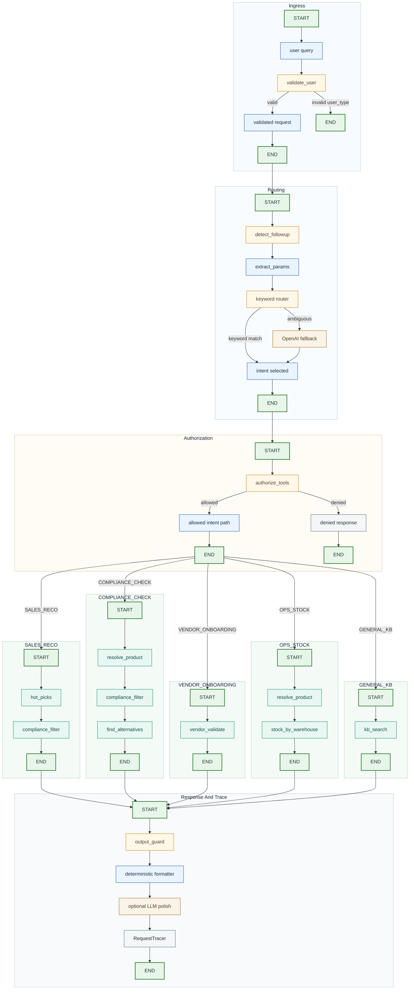

# AI Chat Service PoC

Tool-first agentic backend over mock ERP data with deterministic compliance, LangGraph orchestration, minimal session state, and structured observability.

## How To Run

One command:

```bash
uv run main.py
```

Notes:
- `uv run` uses the project environment and lockfile.
- Copy `.env.example` to `.env` only if you want optional OpenAI-backed classification fallback or optional LLM response polishing.
- No database setup. No Docker. Data loads from `data/seed_data (3).json` at startup.

## Architecture Overview



Flow notes:
- `validate_user` runs first. Invalid `user_type` requests stop before routing or tool calls.
- `classify_intent` keeps routing cheap with keyword logic first and only uses OpenAI fallback when the query is ambiguous and `OPENAI_API_KEY` is configured.
- `authorize_tools` enforces per-user-type allowlists before any deterministic business tool runs.
- Each chain is tool-first. LLMs may classify or polish text, but they do not decide live compliance or inventory truth.
- `output_guard` and `RequestTracer` close every request with compliance-safe output and structured telemetry.

Design constraints:
- Exactly 5 intents are routed.
- Live facts come from deterministic tools, not LLM text generation.
- Session state stays minimal: `last_intent`, `last_state`, `last_budget`, `last_product_ids`.
- LLM use is optional. Without `OPENAI_API_KEY`, the system still runs end to end.

## Where Routing, Tools, State, And Observability Live

| Area | File | Purpose |
|---|---|---|
| Routing | `src/router.py` | `detect_followup()`, `extract_params()`, `classify_intent()` |
| Tools | `src/tools.py` | `hot_picks`, `compliance_filter`, `stock_by_warehouse`, `vendor_validate`, `kb_search` |
| State | `src/state.py` | In-memory session state: `last_intent`, `last_state`, `last_budget`, `last_product_ids` |
| Observability | `src/observability.py` | `RequestTracer`, token estimates, JSONL traces |

Additional core modules:

| File | Purpose |
|---|---|
| `src/graph.py` | LangGraph orchestration and `run_query()` entry point |
| `src/guardrails.py` | `validate_user`, `authorize_tools`, `output_guard`, `redact_for_llm()` |
| `src/chains.py` | Canonical intent chains and tool-call recording |
| `src/data.py` | Seed data loading, product resolution, alternative lookup |
| `src/models.py` | Pydantic schemas, allowlists, business policy |
| `src/settings.py` | Centralized runtime config via `configs.<key>` |
| `src/logging_config.py` | Loguru bootstrap for application logging |
| `main.py` | CLI entry point |

## Configuration

All runtime settings are centralized in `src/settings.py` and exposed through `configs.<key>`.

| Variable | Default | Description |
|---|---|---|
| `OPENAI_API_KEY` | `(none)` | Enables LLM fallback classification and optional response polishing |
| `USE_LLM_FORMATTING` | `false` | Enables optional LLM polishing around deterministic output |
| `LOG_LEVEL` | `INFO` | Application log verbosity |
| `LOG_DIR` | `.logs` | Directory for application and trace logs |
| `LOG_FILE` | `application.log` | Main application log filename |

## Testing

```bash
uv run pytest
```
